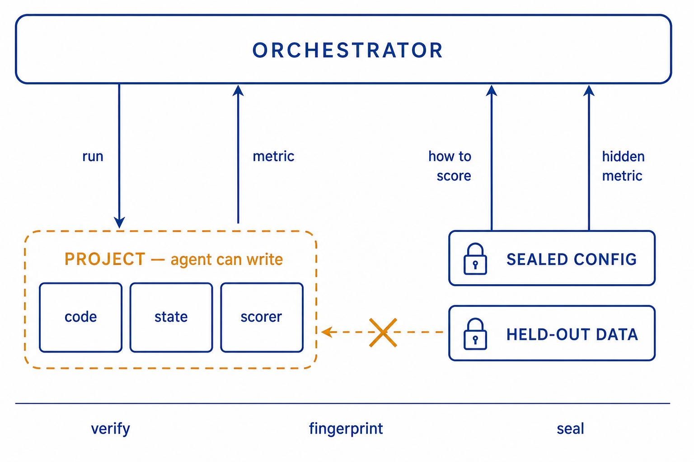

# evaloop

[](https://github.com/leoncuhk/evaloop/actions) [](LICENSE) [](https://www.python.org/downloads/)

**Evaluation-driven autonomous development.** For loops whose acceptance
criterion is a *metric*, not a test suite.

When an agent's work is judged by a number, the agent is also editing the thing
that produces the number. Left alone, a long loop optimises the measurement
rather than the work, and reports success. This harness keeps the measurement
alive under that pressure: verification the orchestrator runs, a held-out metric
the agent never sees, a scoring definition it cannot reach or rewrite, and a
record of which numbers are trustworthy. Under 1000 lines of Python, nothing
outside the standard library, no Docker.

> **The claim, stated narrowly**: a loop can only run unattended for as long as
> its metric survives its own optimiser. Everything here exists to extend that.

## Is this for you?

| Your acceptance criterion | Use |
|---|---|
| A test suite the agent shouldn't edit | Claude Code, Cursor, [Spec Kit](https://github.com/github/spec-kit). This adds little |
| A quality score you read yourself | An eval platform — [DeepEval](https://deepeval.com), [Inspect AI](https://inspect.aisi.org.uk), [Braintrust](https://braintrust.dev) |
| A metric the agent optimises, on code the agent writes | **This** |

The third row is where autonomous development actually breaks. Research agents
on [MLE-bench](https://arxiv.org/html/2507.02554) show a persistent **9–13%
validation/test generalization gap**: an agent optimising a proxy metric
reliably converges somewhere the held-out set does not follow. It is not
malice — it is what optimisers do. A number the agent never sees is the only
measurement that survives it.

This repository contains a worked case of the failure. An 11-round
hyperparameter sweep improved its metric by 22.5%, every round scored on the
same segment it selected from, and the held-out run that would have settled it
was executed once and its result discarded. Full record in
[`examples/qlib-quant/.state/history/`](examples/qlib-quant/.state/history/).

## What it does

| Layer | What it means here |
|---|---|
| **Verification** | `verify_command` — run by the orchestrator, not reported by the agent |
| **Held-out metric** | `hidden_verify_command` — written to `.state/hidden_metrics.json`, never fed back |
| **Scoring integrity** | `--sealed-verify` puts the definition beyond the agent's reach; in-project scorers are fingerprinted around every session |
| **Provenance** | Every recorded metric says whether it was sealed, tampered with, or leaked |
| **Session loop** | Optional. Stateless sessions, file-based state, circuit breaker, budget cap |

In [Loop Engineering](https://addyosmani.com/blog/loop-engineering) terms this is
Loop 2 with a thin Loop 3 attached; in [harness
engineering](https://addyosmani.com/blog/agent-harness-engineering/) terms it is
the enforcement layer, and it assumes you already have an execution layer —
Claude Code, the Agent SDK, or your own.

## Three ways to use it

### 1. As an evaluator for a search loop you already have

The one that needs no buy-in. Evolutionary program search
([AlphaEvolve](https://deepmind.google), [OpenEvolve](https://github.com/codelion/openevolve),
[ShinkaEvolve](https://github.com/SakanaAI/ShinkaEvolve)) tells you to design an
unhackable evaluator and leaves that to you. This is that evaluator:

```python
from pathlib import Path
from core import run_verification, load_conf

conf = load_conf(Path("modes/researcher"))
result = run_verification(
    "/path/to/candidate",              # what the search just produced
    conf,
    sealed=Path("~/scoring/task.conf").expanduser(),   # outside the candidate
    session_label="gen-42",
)
result["verify"]["metric"]        # what the search may optimise
result["hidden"]["metric"]        # what it may not see
result["integrity"]["trusted"]    # False if the candidate rewrote its scoring
```

### 2. As a verification step around your own agent

```bash
python run.py verify ./my-project --sealed-verify ~/scoring/proj.conf
```

Exits non-zero on failure, so it drops into CI or a shell loop unchanged. No
LLM calls, no cost.

### 3. As the whole loop

```bash
python run.py loop ./my-project --sealed-verify ~/scoring/proj.conf
```

Stateless sessions against `hypothesis.md`, verification after each, hidden
metric accumulated across the run, circuit breaker and budget cap.

## Quick Start

```bash
git clone https://github.com/leoncuhk/evaloop
cd evaloop

# Score a project — no LLM calls, no cost. Prints the visible metric,
# records the held-out one, exits non-zero on failure.
python run.py verify examples/quant-lab

# Keep the scoring definition outside the project the agent writes to
echo 'hidden_verify_command=python3 run_backtest.py --split test' > ~/task.conf
python run.py verify examples/quant-lab --sealed-verify ~/task.conf

# Watch the integrity layer catch a session that rewrites its own scorer.
# Replayed from a script — no LLM calls, no cost.
python run.py loop --simulate --pause 0 examples/tamper-demo
# ...and to replay it:
# rm -rf examples/tamper-demo/.state/journal.json examples/tamper-demo/logs

# Run a real loop against your own hypothesis. Copy a working baseline first —
# researcher mode scores by running the project's own evaluation script.
mkdir my-lab
cp examples/quant-lab/{hypothesis.md,run_backtest.py,strategies.py} my-lab/
python run.py verify my-lab          # confirm it scores before spending anything
python run.py loop my-lab --sealed-verify ~/task.conf
```

## The Verification Layer

This is the core value of the project. After each work session:

### 1. Independent `verify_command`

Runs a command that the orchestrator controls, not the LLM. Configured in `mode.conf` or overridden per-project with a `.verify` file:

```ini
# modes/researcher/mode.conf
verify_command = python run_backtest.py --split train

# examples/qlib-quant/.verify (project-level override)
verify_command = python qlib_backtest.py --split train
hidden_verify_command = python qlib_backtest.py --split test
```

### 2. Hidden out-of-sample validation

`hidden_verify_command` runs on data the LLM never sees. The metric is written to `.state/hidden_metrics.json` and is never fed back to the LLM by the orchestrator.

Why it matters, empirically: research agents on [MLE-bench](https://arxiv.org/html/2507.02554) show a persistent **9–13% validation/test generalization gap**. An agent optimising a visible metric will find the gap. A number the agent never sees is the only one that measures whether the work generalizes.

### 3. Scoring integrity

Not surfacing a metric is not the same as an agent being unable to obtain it. Everything under the project directory is writable by the agent — including `.verify` and the scripts it names. A live session in [`examples/goal-vs-loop/logs/session_4.log`](examples/goal-vs-loop/logs/session_4.log) ran the hidden split itself and reported `hidden test split = 1.5233` in its own summary.

Three controls, in order of strength:

**Seal the scoring definition** — `--sealed-verify FILE` reads the verification config from a path outside the project. It outranks the project's `.verify`, so an agent that rewrites `.verify` changes nothing. The harness refuses a sealed file that resolves inside the project.

```bash
# operator-owned, outside the repo the agent works in
echo 'hidden_verify_command=python3 run_backtest.py --split test' > ~/scoring/proj.conf
python run.py loop ./proj --mode researcher --sealed-verify ~/scoring/proj.conf
```

**Fingerprint what does the scoring** — before each session the orchestrator hashes `.verify` and every in-project file the verification commands invoke, then re-hashes afterwards. A change means the session rewrote its own scoring, and the metric is reported as untrusted rather than as a result:

```
verify: PASS (exit 0) | metric: 99.0
TAMPERED: scoring inputs changed during the session: score.py
The metric above was produced by definitions this session rewrote. Do not treat it as a result.
```

**Detect leaks after the fact** — each session's transcript is scanned for the hidden invocation and for the hidden metric's own value. Hits are recorded with the metric, so a contaminated number is never silently mixed with clean ones:

```json
[
  {"session": "1", "metric": 0.84, "timestamp": "...", "sealed": true},
  {"session": "3", "metric": 1.5233, "timestamp": "...", "sealed": false,
   "leaks": ["hidden metric 1.5233 appears in transcript"]}
]
```

This is the architecture [sandbox-policy research](https://github.com/islo-labs/reward-hack-bench) converges on — scoring runs where the agent does not control it, and the verdict is computed outside the agent's reach. Detection is the weakest of the three and is honest about it: it marks a metric contaminated, it never certifies one clean. For adversarial settings, seal the config *and* run the hidden command against data on a filesystem the agent cannot read.

### 4. Budget & stuck controls

- **Circuit breaker**: stops after N consecutive sessions with no progress
- **Budget cap**: `--max-budget` prevents runaway spending
- **Retry**: automatic single retry on error/timeout (don't waste session slots)

## Architecture



The agent works inside the project directory and can write anything in it — its
own code, its own state, its own scorer. The orchestrator sits outside. It reads
how to score from a file the agent cannot reach, runs the scoring itself, and
keeps the held-out number on its own side of that boundary.

Each session starts with a fresh context and ends when its one experiment is
done. What carries across sessions is files, not context: the journal, the
progress log, the learnings. Session 30 reads what session 1 wrote.

| Phase | Prompt | What the session does |
|---|---|---|
| **init** | `theorizer` | Read `hypothesis.md` and the journal, design one experiment |
| **work** | `executor` | Run that experiment, keep it or revert it on the metric |
| **review** | `analyst` | Every N sessions, look across experiments for patterns |
| **orient** | `strategist` | Every M sessions, decide continue / pivot / done |

Input is `hypothesis.md`. State is `.state/journal.json`, `.state/progress.md`,
`.state/learnings.md`. The loop exits when the target metric is reached, the
circuit breaker trips, or the budget is spent.

A mode is just a directory under `modes/`. evaloop ships one; copy it and change
`mode.conf` to point the loop at a different kind of work. The engine reads what
a mode declares — its entry file, state file, work array and status
vocabulary — and knows nothing about the shipped names. See
[CONTRIBUTING.md](CONTRIBUTING.md).

## Project Structure

```
evaloop/
├── run.py              # Verification harness CLI (577 lines)
├── core.py             # Pure functions: verification, integrity, state (433 lines)
├── modes/
│   └── researcher/     # the shipped loop: hypothesis → experiment → evaluate → learn
├── tests/
│   ├── test_run.py     # Unit tests (17 tests)
│   └── test_integration.py  # Integration tests (64 tests)
├── experiments/        # run_validation.py — orchestrator conformance checks
├── docs/               # Design rationale and methodology
└── examples/           # quant-lab, qlib-quant, goal-vs-loop, tamper-demo
    └── <project>/
        ├── .state/learnings.md   # Cross-session knowledge (tracked)
        ├── .state/history/       # Archived records of completed runs
        └── logs/                 # Verbatim session transcripts
```

## Empirical Record

What has and has not actually been measured. Every claim below points at a file
in this repository, so it can be checked rather than taken on trust.

### What was run against a live model

| Example | Sessions | Outcome | Record |
|---|---|---|---|
| `examples/goal-vs-loop` | 4 (Theorizer/Executor ×2) | Sharpe 0.8363 → 1.9084 on synthetic data, target 1.5 met | [`logs/`](examples/goal-vs-loop/logs/), [`.state/history/`](examples/goal-vs-loop/.state/history/), and `session-history.bundle` (`git clone` it to replay all 5 commits) |
| `examples/qlib-quant` | 12, incl. an 11-round sweep | Sharpe 2.9746 → 3.6430 on the 2022 segment of CSI300 | [`.state/history/`](examples/qlib-quant/.state/history/), [`logs/`](examples/qlib-quant/logs/), [`.state/learnings.md`](examples/qlib-quant/.state/learnings.md) |

Both working trees are reset to baseline so the examples start clean; the runs
above are preserved under `.state/history/` rather than in the live state files.

### What those numbers do not show

- **The qlib sweep selected on the segment it scored on.** `--split train` maps
  to the 2022 *valid* segment, and all 11 rounds were chosen by that number. The
  +22.5% is a selection gain, not an out-of-sample result.
- **The hidden split was executed once and the result was lost.**
  [`mlflow-runs.json`](examples/qlib-quant/.state/history/mlflow-runs.json)
  records a `--split test` run at commit `e8bf29f`, but no `hidden_metrics.json`
  was ever written. There is no recorded hidden-OOS figure for this example.
- **`run_qlib_backtest.py` is not qlib's backtest pipeline.** It implements its
  own top-30/bottom-30 long-short with daily full turnover and no transaction
  cost, slippage, or position limits — despite `hypothesis.md` requiring the
  standard pipeline. The configured `topk`/`n_drop` are read but never applied.
  A Sharpe near 3–4 under zero cost is the expected magnitude of that
  construction, not evidence of an edge.
- **goal-vs-loop runs on synthetic data** with injected drift and AR(1)=0.15
  momentum. The mechanism the agent found is real *for that generator* and says
  nothing about real markets.

### What `experiments/run_validation.py` does and does not test

It checks the orchestrator, not the loop's effectiveness:

- **H1 (convergence)** and **H3 (phase decisions)** run against hardcoded
  `SIMULATION_SCRIPTS` whose metric trajectories are written into the script. They
  demonstrate that the state machine advances and halts correctly. They cannot
  demonstrate that a loop converges, because convergence is an input.
- **H2 (generalization)** compares two hand-written strategies across 12 seeds —
  neither was discovered by a loop. At 7/12 the result is not statistically
  distinguishable from chance (binomial *p* ≈ 0.39 against a fair coin), and the
  script's `win_rate >= 55` pass threshold is an arbitrary cutoff, not a test.

Read it as a conformance suite for the orchestrator. An end-to-end validation —
many live runs, measured against a control — has not been done.

## CLI Reference

```
python run.py verify  <project> [--sealed-verify FILE]   # score only, no LLM
python run.py loop    <project> [--sealed-verify FILE] [options]
python run.py status  <project>                          # phase and progress
python run.py list-modes                                 # modes found in modes/
python run.py <project> [options]                        # backward compat → loop

--mode NAME   Any directory under modes/. Defaults to the shipped `researcher`.
```

| Loop option | Default | Description |
|-------------|---------|-------------|
| `--max-sessions` | `50` | Session limit |
| `--max-turns` | `50` | Turn limit within one session |
| `--sealed-verify` | | Scoring config outside the project, beyond the agent's reach |

`verify_timeout` (seconds, default 300) is set in `mode.conf`, `.verify`, or the
sealed file — a full model fit outlives a test suite. A timeout is a failed
check, never a metric.
| `--max-budget` | `10.0` | Maximum cost in USD |
| `--orient-interval` | `10` | Strategic review interval |
| `--review-interval` | `5` | Tactical review every N sessions |
| `--no-progress-max` | `3` | Stuck detection threshold |
| `--pause` | `5` | Seconds between sessions |
| `--simulate` | | Use `.state/sim_script.json` for deterministic testing |

## How This Compares

Three families of tools sit near this one. They solve adjacent problems, and for most of what people need, one of them is the better answer.

**LLM evaluation frameworks** — [DeepEval](https://deepeval.com), [Inspect AI](https://inspect.aisi.org.uk) (UK AISI), [promptfoo](https://promptfoo.dev), [Braintrust](https://braintrust.dev), LangSmith. They score outputs against datasets, with rich metric libraries, LLM-as-judge, CI integration, and red-teaming. **Use them for**: measuring whether a change to a prompt, model, or RAG pipeline made things better. **What they don't do**: wrap a long-running loop in which the agent keeps editing the artifact being scored. Their threat model is a flaky metric, not an agent with write access to the scorer.

**Agent loop harnesses** — [loop-harness](https://github.com/lSAAGl/loop-harness), spec-driven toolkits like [Spec Kit](https://github.com/github/spec-kit), agentic SDLC pipelines. Closest structural siblings: scheduled loops, worktree isolation, a verification gate before anything ships. Their gate is usually a second LLM session judging the first. **Use them for**: shipping agent work safely into a repo. **What they don't do**: hold data back from the agent. An LLM judge is a strong check on *whether the work is sound* and a weak one on *whether the number generalizes*.

**Evolutionary program search** — [AlphaEvolve](https://deepmind.google), [OpenEvolve](https://github.com/codelion/openevolve), [ShinkaEvolve](https://github.com/SakanaAI/ShinkaEvolve). Here the evaluator genuinely is a separate program, with cascade evaluation to prune cheap failures early — architecturally the nearest relative. The community's own guidance is that you must hand-design an unhackable evaluator, because the search will find every loophole in it. **Use them for**: optimising a well-specified objective over many thousands of candidates. **What they don't do**: give you the unhackable evaluator. That is left to you.

**Where this project fits.** It is the small piece those three leave out: a scoring definition the agent cannot reach or rewrite, carried across sessions, with the out-of-sample number withheld by construction rather than by instruction. It is roughly 1000 lines with no dependencies, so it wraps whatever agent you already run instead of replacing it.

**When not to use it.** If your metric is a fixed test suite the agent cannot edit, `verify_command` adds little over running the tests. If you need dashboards, tracing, or dataset management, use a real eval platform. If you need hard isolation against an adversarial agent, you need a sandbox — this gives you sealing and detection, not containment.

### The framing this follows

- **LangChain** [4-loop stack](https://blog.langchain.dev/the-art-of-loop-engineering/): Agent → Verification → Application → Hill Climbing. This project is Loop 2.
- **Osmani** [Loop Engineering](https://addyosmani.com/blog/loop-engineering): "Reliability comes from the loop, not the model."
- **MLE-bench** [research agents](https://arxiv.org/html/2507.02554): a 9–13% validation/test generalization gap — the empirical case for withholding a metric.
- **RewardHackBench** [sandbox policies](https://github.com/islo-labs/reward-hack-bench): scoring belongs in an environment the agent does not control.

## Design Principles

These address the [six failure modes](https://arxiv.org/abs/2601.03315) of autonomous LLM agents:

| Principle | Failure mode it solves |
|-----------|----------------------|
| Independent verification | Overexcitement — orchestrator verifies, not LLM self-report |
| Hidden OOS validation | Overfitting — test data invisible to the LLM |
| Stateless sessions | Context degradation — each session starts fresh |
| File-based state | Context window limits — state survives indefinitely |
| One task per session | Implementation drift — no room to simplify under pressure |
| Circuit breaker | Infinite loops — stuck detection + max sessions + budget cap |
| Deterministic orchestration | All six — code decides flow, not LLM |
| State schema validation | Corruption — malformed state is reported, not acted on |
| Sealed scoring config | Evaluator capture — the agent cannot redefine its own metric |
| Scoring fingerprints | Reward hacking — a rewritten scorer marks the metric untrusted |
| Leak detection | Silent contamination — hidden-metric leaks are recorded with the metric |

## Prerequisites

```bash
pip install claude-agent-sdk               # Optional: adds SDK hooks and cost tracking
npm install -g @anthropic-ai/claude-code   # Claude Code CLI (alternative to SDK)
```

Either SDK or CLI works. Use `--simulate` to test without either.

## FAQ

**How much does it cost?**
`verify` subcommand is free (no LLM). Each `loop` session is one Claude Code invocation. `--max-budget` caps total spend.

**Can I use a different LLM?**
Yes. The verification layer is LLM-agnostic. Replace the `claude -p` call in `run_cli_session()` with your CLI tool.

**Can I resume after Ctrl+C?**
Yes. Same command again. The engine re-reads `.state/` and continues from where it left off.

**What's the `.verify` file?**
A per-project override for the scoring commands, taking precedence over `mode.conf`. It lives inside the project, so the agent can edit it — which is why a session that changes it is reported as `TAMPERED`, and why `--sealed-verify` exists for the cases where that is not good enough.

**Why is there a mode system if only one mode ships?**
Because a mode is the only thing that describes your loop: which file states the goal, which file holds the work, and what statuses that work can be in. The engine reads those declarations and knows nothing about the name `researcher`. Copy `modes/researcher/` to point the loop at different work.

**What happened to engineer and auditor modes?**
Cut in 7.0. Everything that makes this project worth using — held-out metrics, sealed scoring, integrity checks — only applied to the metric-scored loop. See [the design rationale](docs/design-rationale.md).

## References

**Design:**
- [Design Rationale](docs/design-rationale.md) — Why this architecture, what alternatives were considered
- [Archived essays](docs/archive/) — the stateless-session argument, the OODA outer loop and
  the Peirce three-role case, written for the three-mode architecture that shipped
  through v6. The arguments hold; the mode inventory does not

**Loop Engineering:**
- [Addy Osmani — Loop Engineering](https://addyosmani.com/blog/loop-engineering) — Canonical definition (June 2026)
- [Boris Cherny — Claude Code & the Future of Engineering](https://x.com/AcquiredFM/status/2062621816393297920) — "My job is to write loops" (June 2026)
- [LangChain — The Art of Loop Engineering](https://blog.langchain.dev/the-art-of-loop-engineering/) — Four-loop stack

**Research:**
- [Why LLMs Aren't Scientists Yet](https://arxiv.org/abs/2601.03315) — Six failure modes in autonomous LLM research (arXiv, 2026)
- [Building Effective AI Coding Agents](https://arxiv.org/abs/2603.05344) — Scaffolding + harness architecture (arXiv, 2026)
- [Anthropic Agentic Coding Trends](https://resources.anthropic.com/2026-agentic-coding-trends-report) — Industry landscape (2026)

**Related tools:**
- [Claude Code](https://docs.anthropic.com/en/docs/claude-code) — Terminal-native AI agent by Anthropic
- [Claude Agent SDK](https://github.com/anthropics/claude-agent-sdk-python) — Python SDK for agent loops
- [GitHub Spec Kit](https://github.com/github/spec-kit) — Spec-driven development toolkit
- [OpenHands](https://github.com/All-Hands-AI/OpenHands) — Full-platform autonomous coding agent
- [Omnigent](https://github.com/databricks/omnigent) — Meta-harness for composing agent loops

## Contributing

See [CONTRIBUTING.md](CONTRIBUTING.md). Run `python tests/test_run.py && python tests/test_integration.py` before submitting.

## License

AGPL-3.0. See [LICENSE](LICENSE).
