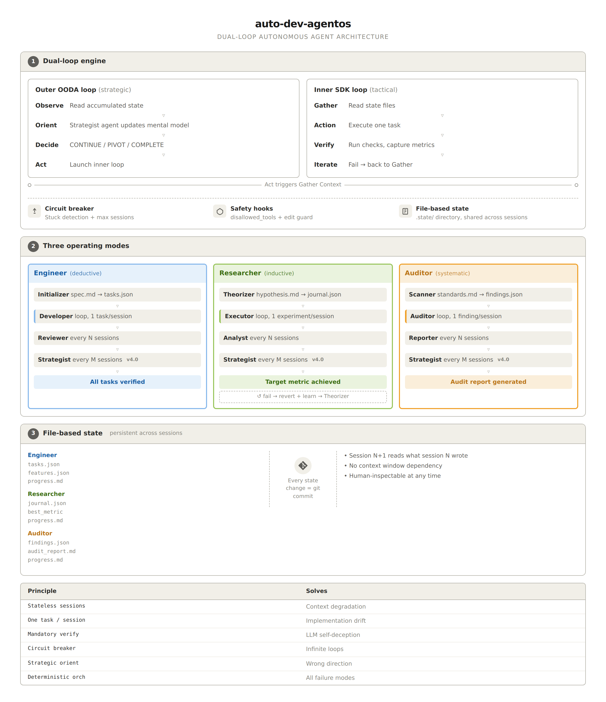

# The Dual-Loop Agent: Why Your Autonomous Pipeline Needs Both OODA and SDK Loops

*An architectural evolution for [auto-dev-agentos](https://github.com/leoncuhk/auto-dev-agentos), integrating strategic orientation into autonomous AI agent systems.*

---

## The Missing Phase

The [Stateless Agent Architecture](stateless-agent-architecture.md) solved the six failure modes of autonomous LLM agents through five principles: deterministic orchestration, stateless sessions, file-based state, one task per session, and mandatory verification.

These principles produce a **convergent loop** — each session moves the project closer to a well-defined target (all tests pass, all tasks done, target metric achieved). This works because the loop has a clear exit condition and the environment doesn't change between sessions.

But what happens when the direction is wrong?

A convergent loop can efficiently execute a bad plan. If the task decomposition is flawed, or the research hypothesis is wrong, or the audit scope is too narrow, the inner loop will diligently grind through sessions that produce no real progress. The circuit breaker eventually kills it, but by then you've burned 15 sessions going nowhere.

The missing piece is **strategic orientation** — a periodic check that asks not "am I making progress?" but "am I going in the right direction?"

## Two Loops, Two Purposes

This is the same distinction John Boyd made in his OODA loop (Observe–Orient–Decide–Act), designed for air combat in the 1970s. Boyd's key insight was that **Orient** — the continuous updating of your mental model — is the most important phase. It determines what you observe and how you act.

Anthropic's Agent SDK codifies a different loop: **Gather Context → Take Action → Verify → Iterate**. This loop assumes a stable target and deterministic verification — exactly right for software engineering tasks where "tests pass" is an unambiguous success criterion.

The two loops aren't competing alternatives. They operate at different levels:

| | SDK Loop (Tactical) | OODA Loop (Strategic) |
|---|---|---|
| **Question** | Am I executing correctly? | Am I going the right direction? |
| **Timescale** | One session | Across multiple sessions |
| **Feedback** | Test pass/fail, metric up/down | Trajectory, patterns, dead ends |
| **Exit condition** | Task verified | Target achieved or direction exhausted |
| **Nature** | Convergent (approaches fixed target) | Non-convergent (target may shift) |

The architectural insight: **nest the convergent SDK loop inside the non-convergent OODA loop**.

```
Outer OODA Loop (every N sessions):
  Observe  — Read accumulated state, metrics, learnings
  Orient   — Update mental model: what's working? what's a dead end?
  Decide   — Continue / Pivot / Complete
  Act      — Run a batch of inner-loop sessions

  Inner SDK Loop (each session):
    Gather Context  — Read state files
    Take Action     — Implement one task / run one experiment
    Verify          — Run checks, capture metrics
    Iterate         — Retry if failed, return to outer loop if verified
```



*Figure: the architecture as of v4.0, when the outer loop was introduced. The
state-file lists predate `.state/learnings.md`; the loop structure is unchanged.*

## Why Orient Can't Be Implicit

In auto-dev-agentos v3.0, the Reviewer (engineer mode) and Analyst (researcher mode) partially fill the Orient role. They check health metrics and detect stuck patterns. But they have a structural limitation: **they run at the same level as the work sessions**.

The Reviewer can say "Task T7 has been in_progress for 3 sessions." But it can't say "The entire frontend approach is wrong because we skipped the CSS setup, and tasks T7-T12 will all fail for the same reason. We need to add a prerequisite task."

The Analyst can say "3 of 4 experiments were rejected." But it can't say "All three failures used lagging indicators. The mental model should be updated: only trend-confirming indicators work in this data. Future experiments must follow this constraint."

Both of these are **Orient-level** insights — they require synthesizing across sessions to update the model of what works and what doesn't. The v3.0 review prompts partially capture this, but without making it an explicit, separate phase with its own evaluation framework.

## The Strategist Agent

auto-dev-agentos v4.0 introduces a **Strategist** prompt for each mode — the explicit Orient phase of the outer OODA loop. It runs every `orient_interval` sessions (default: 10) and produces one of three decisions:

**CONTINUE** — The current direction is productive. Keep executing.

**ADJUST / PIVOT** — The direction needs to change. The strategist modifies the state files:
- Engineer: adds missing tasks, splits oversized ones, reorders priorities
- Researcher: adds new experiments in a different direction, updates the mental model
- Auditor: expands scope to cover gaps, adds new findings to investigate

**COMPLETE / BLOCKED** — The work is done, or requires human intervention.

The key difference from the Reviewer/Analyst: the Strategist operates on **accumulated evidence across all sessions**, not just recent ones. It asks "what do we now believe about this problem?" — the Orient question — rather than "are the metrics healthy?" — the Verify question.

### Permission Model

The Strategist runs under `bypassPermissions` but with `disallowed_tools=["Bash", "Write"]` — these hard blocks override bypass mode (per the SDK permission chain: `disallowed_tools` evaluates before `permission_mode`). A PreToolUse hook additionally restricts `Edit` to `.state/` files only. The net effect:

- **Can**: Read any file, Edit `.state/tasks.json`, `.state/journal.json`, `.state/progress.md`
- **Cannot**: Run Bash commands, create new files, modify application code

This is deliberate:

1. **Separation of concerns**: Strategy (what to do) vs. Tactics (how to do it)
2. **Reversibility**: State file changes are lightweight and easily reverted
3. **Safety**: A strategist that modifies code could introduce bugs that persist across sessions

### Preventing Strategic Oscillation

Each Strategist session is stateless — it has no memory of its previous decisions. Without safeguards, it could flip-flop between contradictory strategies. The fix is structural: the Strategist writes its decision to `progress.md` as a `**Role**: Strategist` entry, and subsequent Strategist sessions are required (by prompt) to read and acknowledge previous decisions before making new ones. Reversing a previous decision requires explicitly stronger evidence.

## SDK Engine: Hooks and Cost Tracking

The v4.0 SDK engine (`run.py`) implements the dual-loop in Python using the Claude Agent SDK. Beyond the architectural change, it adds capabilities that the shell engine can't provide:

**Safety hooks**: PreToolUse hooks intercept dangerous Bash commands (`rm -rf`, `git push --force`) before execution. The `disallowed_tools` parameter provides hard tool-level blocks that override even `bypassPermissions` — this is how the Orient phase is constrained to read + state-edit only (no Bash, no Write). Note: the Bash-level safety guard uses substring matching and is best-effort, not a security boundary. For production, run in a sandboxed container.

**Cost tracking**: Every session reports its cost via `ResultMessage.total_cost_usd`. The engine tracks cumulative cost and prints it in the summary. For API-key billing, this enables budget-aware orchestration.

**Pure Python phase detection**: The shell engine depends on `jq` for evaluating mode-specific queries. The SDK engine implements the common patterns (`[.items[] | select(.status == ...)] | length`) in pure Python, eliminating the dependency.

`run.py` is the single engine, with a CLI fallback mode that works without the Claude Agent SDK installed.

## When the Outer Loop Matters Most

The dual-loop architecture adds value roughly proportional to **how uncertain the direction is**:

| Scenario | Outer loop value | Why |
|---|---|---|
| Well-specified engineering (todo app) | Low | Clear spec, clear tasks, just execute |
| Complex engineering (unfamiliar stack) | Medium | Tasks may be mis-decomposed, need reordering |
| Research (quant strategy optimization) | High | Many dead ends, direction shifts, mental model updates |
| Audit (security review) | Medium | Coverage gaps may not be obvious until mid-audit |
| Exploratory research (novel domain) | Very high | Hypothesis itself may need revision |

For the quant-lab example, the outer loop would have caught the pattern after EXP-002 and EXP-003: "Both lagging indicators failed. Update mental model: only trend-confirming indicators work here." Instead, this insight emerged organically through the Analyst review. The Strategist makes this systematic.

## Creating a New Mode with Dual-Loop

Same as before — create `mode.conf`, `CLAUDE.md`, and prompt files — but now with four prompts instead of three:

```
modes/<your-mode>/
├── mode.conf              # Add: phase_orient=strategist
├── CLAUDE.md
└── prompts/
    ├── initializer.md     # Init phase
    ├── worker.md          # Work phase
    ├── reviewer.md        # Tactical review
    └── strategist.md      # OODA Orient (new)
```

The strategist prompt should:
1. Define what "trajectory" means for this mode (metrics, completion rate, etc.)
2. Define what "mental model update" means (what beliefs can change?)
3. Define the decision space (continue/pivot/complete with mode-specific semantics)
4. Be read-only — modify state files only, never application code

---

## Summary

| Architecture | Loop type | Exit condition | Orient phase | Best for |
|---|---|---|---|---|
| v3.0–v4.0 | Single convergent | All tasks done / metric reached | Implicit (reviewer) | Well-defined tasks |
| v5.0 (run.py) | Nested dual-loop | Strategic + tactical | Explicit (strategist) | Uncertain direction |

The convergent loop is necessary. The strategic loop makes it reliable even when you start from the wrong direction.

---

*References:*
- *John Boyd, "Patterns of Conflict" (1986) — OODA loop as a theory of competitive advantage*
- *Anthropic, "Building Agents with the Claude Agent SDK" (2026) — Four-stage feedback loop*
- *["Why LLMs Aren't Scientists Yet"](https://arxiv.org/abs/2601.03315) — Six failure modes in autonomous LLM research*
- *[Stateless Agent Architecture](stateless-agent-architecture.md) — The five principles that v4.0 builds on*
