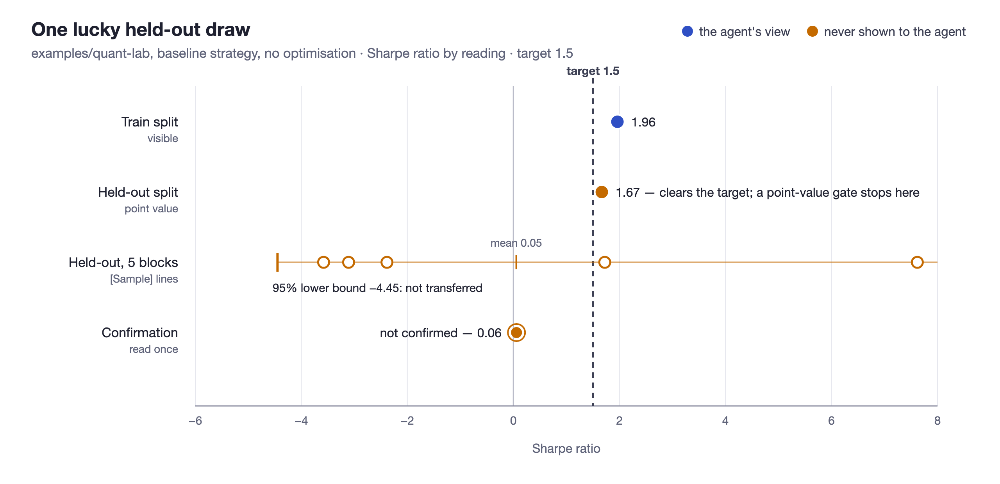

# Empirical record

What has and has not actually been measured. Every claim below points at a file
in this repository, so it can be checked rather than taken on trust.

### What was run against a live model

| Example | Sessions | Outcome | Record |
|---|---|---|---|
| `examples/goal-vs-loop` | 4 (Theorizer/Executor ×2) | Sharpe 0.8363 → 1.9084 on synthetic data, target 1.5 met | [`logs/`](../examples/goal-vs-loop/logs/), [`.state/history/`](../examples/goal-vs-loop/.state/history/), and `session-history.bundle` (`git clone` it to replay all 5 commits) |
| `examples/qlib-quant`<br>([prerequisites](../examples/qlib-quant/PREREQUISITES.md)) | 12, incl. an 11-round sweep | +0.68 on the selected segment across 5 folds (*t*=5.94); **+0.03 held out (*t*=0.06)** | [`.state/history/`](../examples/qlib-quant/.state/history/), [`logs/`](../examples/qlib-quant/logs/), [`.state/learnings.md`](../examples/qlib-quant/.state/learnings.md) |

Both working trees are reset to baseline so the examples start clean; the runs
above are preserved under `.state/history/` rather than in the live state files.

### The held-out measurement

The qlib configurations were scored against years no tuning round ever saw, with
the scoring definition sealed outside the project. This is the result the whole
harness exists to obtain. Method, caveats and reproduction:
[single fold](../examples/qlib-quant/.state/history/hidden-oos-2026-07-30.md),
[five folds](../examples/qlib-quant/.state/history/rolling-2026-07-31.md).

Five folds. Each trains from 2018, selects on one year, and is scored on the
next. Paired difference between the tuned configuration and the baseline:

| Segment | Mean | s.d. | *t*(4) | Folds positive |
|---|---|---|---|---|
| **Selected on** | **+0.6787** | 0.256 | **+5.94** | 5 / 5 |
| **Held out** | **+0.0260** | 0.906 | **+0.06** | 3 / 5 |

**The tuning reliably improves the metric it was selected on and does nothing
measurable to the one it was not.** Every fold agrees on the first. None agree on
the second.

Nobody cheated in any of these runs. The eleven-round sweep that produced
λ=100/200 was careful, honest work, and what it produced is a dependable
improvement to a number and a null result on the thing that number stood for.
This is what a held-out metric buys, and no amount of care on the visible segment
would have revealed it.

It also corrects this file twice. An earlier version called the +22.5% "a
selection gain, not an out-of-sample result" — too strong on one fold. The
single-fold record then softened that to "the direction transferred, the
magnitude did not", because the held-out figure had moved from −1.1125 to
−0.0297. Four more folds show that +1.08 sitting inside a spread of 0.91 with two
folds moving the other way: the direction did not transfer either. The fold this
project had been reasoning from is also the worst held-out fold in the study.

### Noise at the gate

`examples/quant-lab` with its shipped baseline strategy — no optimisation at
all — and a 1.5 Sharpe target. Every figure below is deterministic (seeded) and
reproducible:

```bash
D=$(mktemp -d); mkdir -p $D/ql/.state
cp examples/quant-lab/{hypothesis.md,run_backtest.py,strategies.py} $D/ql/
# the train-split figure, written to the journal as a loop would
echo '{"experiments": [], "best_metric": 1.9644, "target_metric": 1.5}' > $D/ql/.state/journal.json
printf 'hidden_verify_command=python3 run_backtest.py --split test\nconfirm_verify_command=python3 run_backtest.py --split confirm\n' > $D/task.conf
python3 run.py verify   $D/ql --sealed-verify $D/task.conf
python3 run.py evidence $D/ql --sealed-verify $D/task.conf --confirm
```

| Reading | Figure | What the gate made of it |
|---|---|---|
| Train split (visible) | 1.9644 | clears 1.5 |
| Held-out split, point value | 1.6689 | clears 1.5 — the gate opens and a loop would stop here |
| Held-out split, five 30-day blocks (`--blocks 5`) | −3.11, 7.62, −3.58, 1.73, −2.39 | 95% lower bound −4.45: `NOT TRANSFERRED` |
| Confirmation split, read once | 0.0596 | `NOT CONFIRMED` |



The point value passes and the strategy has no edge: a third draw from the same
process scores 0.06. Nothing misbehaved; one held-out number was simply lucky.
Either added control catches it — the lower bound because the blocks disagree
wildly, the confirmation because it is a fresh draw nobody selected on.

Caveats. The data are synthetic. The mean of per-block Sharpe ratios (0.05) is
not the full-sample Sharpe (1.67), so the lower bound here is on a related
quantity, not the same one; a scorer should print samples whose mean *is* its
metric — per-fold scores, per-item accuracies — and Sharpe blocks only
approximate that. This demonstrates the mechanism on one case. It is not a
measurement of how often point-value gates mislead.

### What those numbers do not show

- **The qlib sweep selected on the segment it scored on.** `--split train` maps
  to the 2022 *valid* segment, and all 11 rounds were chosen by that number.
  Every Sharpe in the journal is a statement about 2022 alone.
- **Five folds, one universe, one model family.** Not a distribution over
  markets, model classes or feature sets. The paired *t* also assumes folds are
  independent, and overlapping training windows make them correlated — which
  inflates the selected-segment statistic. The held-out result is null either
  way, and null is the finding.
- **`run_qlib_backtest.py` is not qlib's backtest pipeline.** It implements its
  own top-30/bottom-30 long-short with daily full turnover and no transaction
  cost, slippage, or position limits — despite `hypothesis.md` requiring the
  standard pipeline. The configured `topk`/`n_drop` are read but never applied.
  A Sharpe near 3–4 under zero cost is the expected magnitude of that
  construction, not evidence of an edge.
- **goal-vs-loop runs on synthetic data** with injected drift and AR(1)=0.15
  momentum. The mechanism the agent found is real *for that generator* and says
  nothing about real markets.

### What has not been measured

An end-to-end validation — many live runs against a control — has not been done.

Through 6.x this repository shipped `experiments/run_validation.py`, which
printed "the Loop Engineering approach is VALIDATED". It did not establish that.
Two of its three hypotheses ran against hardcoded scripts whose metric
trajectories were written into the file, so convergence was an input rather than
a finding; the third compared two hand-written strategies across 12 seeds, at
7/12 — indistinguishable from a coin (binomial *p* ≈ 0.39) — against an arbitrary
55% pass threshold. What it genuinely checked, phase decisions and end-to-end
orchestration, is covered by the test suite and by CI. It was removed in 7.0
rather than kept with a corrected verdict.
